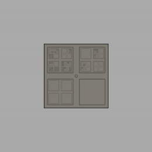

# threequarters
coloring in three of a square's four subsquares colors in the square

enter top-left: '1'

enter top-right: '2'

enter bottom-left: '3'

enter bottom-right: '4'

move out a scale: SPACE

generate new puzzle: CLICK

